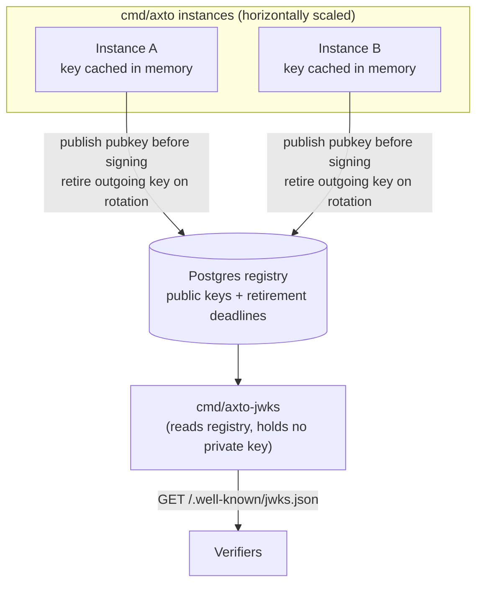

# Axto

[](https://github.com/aniket/axto/actions/workflows/ci.yml)
[](LICENSE)
[](https://pkg.go.dev/github.com/aniket/axto)

**Axto** (Access Token Exchange) is a minimal, internal-only signing
service. It holds a signing key and does exactly one thing: sign a claim
set as a token, for a caller that has already decided the claims are
worth asserting. It never verifies anything, never looks anything up, and
has no database.

The idea is deliberately narrow: verification, authorization, claim
shape, revocation policy — all of that belongs to whatever calls Axto,
not to Axto itself. Keeping the signing service this small is what makes
it auditable and safe to trust with a private key.

## What it exposes

```
POST /internal/tokens:mint      (internal only, bearer-token gated)
  { "claims": {...}, "tokenType": "jwt", "ttlSeconds": 300 }
  -> { "token": "eyJ...", "jti": "...", "expiresAt": "..." }

GET /.well-known/jwks.json      (public, unauthenticated)
```

`claims` is opaque to Axto — it signs whatever it's given, adding only
`iat`/`exp`/`jti`. Every other design decision (what a `sub` looks like,
whether a token carries a grant, actor chains for delegation) lives
entirely in what the *caller* puts into `claims` before calling Mint, not
in this repo. This contract is intentionally the whole surface area, and
it's not expected to grow — see [CONTRIBUTING.md](CONTRIBUTING.md) before
proposing something that would change it.

## Running locally

Axto is configured entirely from a YAML file, passed with `-config`:

```
go run ./cmd/axto -config configs/axto.dev.yaml
```

`configs/axto.dev.yaml` is a single in-memory instance with no database
and no rotation — for local development only. `internalToken` is the
shared secret that gates `/internal/tokens:mint`; it's a placeholder for
real service-to-service auth (mTLS, or an internal-only network boundary
that makes the whole question moot).

## Running horizontally

Axto scales the way SPIRE Server does, not the way Dex does: there is no
single shared signing key coordinated through a lock. Each `cmd/axto`
instance generates and caches its own key **in memory**, and signs from
that cache — a signing call never touches the network. What *is* shared
is a small registry table (Postgres today) that instances publish their
public key to, and a separate, stateless `cmd/axto-jwks` service that
reads that table and serves the union of every instance's still-valid
public keys as one JWKS document. Verifiers only ever talk to the
aggregator, never to a specific signer instance.



Each key also has its own lifecycle, ticked by `keys.ManagedStore` on a
schedule rather than rotated all-at-once:

- **Stage past half life.** Once a key is past half of `keys.lifetime`,
  a replacement is generated and published — but not used for signing yet.
- **Activate at expiry.** Once the current key's lifetime is up, the
  staged key becomes the signer, and the outgoing key is retired.
- **Retire, don't delete.** A retired key stays servable in JWKS for
  `keys.maxTokenTTL` afterward — long enough for any token it already
  signed to finish its own lifetime. `mint.Service` enforces the matching
  cap on requests, so a token can never outlive its own verifiability.
  Keep `maxTokenTTL` at or below half of `lifetime` so at most two keys
  are ever servable at once in steady state.
- **Publish before sign**, always — a verifier should never see a `kid`
  that isn't in JWKS yet.

Copy [`configs/axto.example.yaml`](configs/axto.example.yaml) and
[`configs/axto-jwks.example.yaml`](configs/axto-jwks.example.yaml), fill
them in, and run:

```
axto -config /path/to/axto.yaml
axto-jwks -config /path/to/axto-jwks.yaml
```

A config value written as `"env:VAR_NAME"` is read from the environment
instead of the file — the intended way to keep secrets (the internal
token, the database URL) out of a file that might get checked in.

Run several `cmd/axto` replicas and one or more `cmd/axto-jwks` replicas
behind a load balancer, all pointed at the same database. Schema changes
are applied automatically on startup by every instance, via versioned
migrations under `internal/registry/migrations` — safe under concurrent
startup since the migration driver takes its own advisory lock.

## Status

Early: in-memory signing key per instance (`keys.InMemoryStore` for a
single dev process, `keys.ManagedStore` for the horizontally scaled mode
above), a Postgres-backed key registry, and the JWKS aggregator. Not yet
wired into a real caller.

## Contributing

Contributions are welcome — see [CONTRIBUTING.md](CONTRIBUTING.md) for
the development workflow and the DCO sign-off required on every commit.
This project follows the [Code of Conduct](CODE_OF_CONDUCT.md).

## Security

See [SECURITY.md](SECURITY.md) for how to report a vulnerability.

## License

Apache License 2.0 — see [LICENSE](LICENSE).
